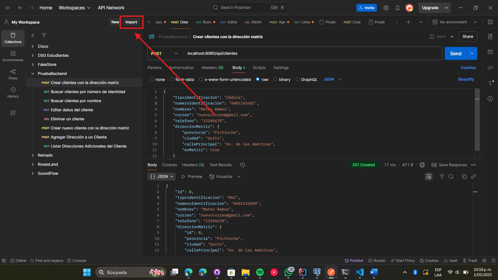

# Prueba Práctica - Servicio de Clientes
*Autor: Dylan Hernández*


## 1. Objetivo:
Desarrollar un servicio con el lenguaje java en su versión 8 o superior, que se conecte a una base de datos local y que exponga un listado de API REST.


## 2. Tecnologías Usadas:
- Java 17 (Necesario)
- Spring Framework 3.4.5
- PostgreSQL 16.3

## 3. Configuración Previa:
Este proceso depende de tener instalado Java 17 y PostgreSQL en su máquina Windows.
1. Clonar el repositorio:
```bash
git clone
```
2. Crear una base de datos en PostgreSQL llamada `negocio`:
```sql
CREATE DATABASE negocio;
```
3. Modificar el archivo `application.properties` para que coincida con su configuración de PostgreSQL:
```properties
spring.datasource.url=jdbc:postgresql://localhost:5432/negocio
spring.datasource.username=postgres
spring.datasource.password=<reemplazar con su contraseña>
```
### Opción 1: Con IDE (IntelliJ IDEA)
Ejecutar la clase `PruebaNegocioApplication` como una aplicación Java normal.

### Opción 2: Terminal
Ejecutar el programa usando Java 17 (con Terminal de Windows):
```bash
java -jar pruebanegocio-0.0.1-SNAPSHOT.jar
```
#### Importante!
Si tiene varias versiones de Java instaladas, puede configurar la variable de entorno `JAVA_HOME` para asegurarse de que se use la versión correcta.
```bash
set JAVA_HOME="C:\Program Files\Java\jdk-17"
set PATH=%JAVA_HOME%\bin;%PATH%
```

## 4. Pruebas de Postman Listas:
[¡Disponibles aquí!](https://github.com/dylanhdz/pruebanegocio/blob/main/pruebas_con_postman.json)
<br>Para ahorrar tiempo, ya está lista una colección de Postman para probar los endpoints de la API con objetos listos.
1. Click en el botón de importar en Postman.
2. Seleccionar la opción de importar desde archivo.
3. Seleccionar el archivo [`pruebas_con_postman.json`](https://github.com/dylanhdz/pruebanegocio/blob/main/pruebas_con_postman.json) que se encuentra en la raíz del proyecto.



## 5. ¿Cómo usar la API REST? - Documentación con Swagger
Con la aplicación corriendo, la documentación interactiva está disponible en `http://localhost:8080/swagger-ui/index.html#/`

## 6. Endpoints disponibles:
Endpoint principal: `http://localhost:8080/api`
| Método | Endpoint | Descripción |
|--------|----------|-------------|
| GET    | /clientes | Obtener todos los clientes |
| GET    | /clientes?clave="clave" | Obtener clientes por # de Identificación o nombre  |
| POST   | /clientes | Crear un nuevo cliente con dirección matriz|
| PUT    | /clientes/{id} | Actualizar un cliente existente |
| DELETE | /clientes/{id} | Eliminar un cliente por ID |
| POST    | /clientes/{id}/direcciones | Agregar Dirección a un Cliente |
| GET    | /clientes/{id}/direcciones | Listar Direcciones del Cliente |

## 7. Uso de TDD
Se empezó por TDD con JUnit usando semáforo rojo-verde-refactor y el esquema arrange-act-assert.

Como siempre, falla la prueba al principio, luego se implementa el código para que pase la prueba y finalmente se refactoriza el código.
```java
@Test
    void crearCliente_ClienteValido_CreaCliente() {
        // Arregla
        Cliente clienteSolicitado = Cliente.builder()
                .nombres("Dylan Hernández")
                .numeroIdentificacion("1234567890")
                .build();
        // Actúa
        clienteService.crearCliente(clienteSolicitado);
        // Asegura
        // Verificar que el cliente fue guardado en el repositorio
        Mockito.verify(clienteRepository).save(clienteSolicitado);
    }
```
También se usó Mockito con las pruebas unitarias de la implementación de la API REST.

Para correr las pruebas, se usa el siguiente comando. Si no funciona, véase la sección de configuración previa
```bash
mvn test
```

## 8. Diagrama de Clases
1. Un cliente puede tener varias direcciones (1-N)
2. Una dirección pertenece a un cliente (N-1)
3. Entonces, es una relación de uno a muchos.


